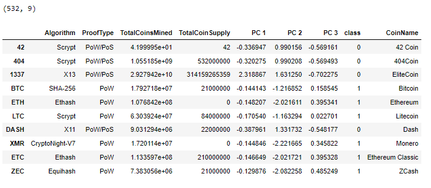

# Cryptocurrencies

## Overview of the analysis

This analysis is done to provide a report that includes what cryptocurrencies are on the trading market and how they could be grouped to create a classification system for cryptocurrency investment portfolio for bank's customers by using unsupervised learning, clustering algorithm and data visualizations. 

## Results

First the cryptocurrencies data was cleaned: 

- only cryptocurrencies that are being traded, have a working algorithm and mine coins are kept

- all null values are dropped

- only columns that are needed for he analysis are kept

  

- the data is standardized using StandardScaler()

Then using PCA dimension was reduced to three principal components

Later using Elbow Curve the optimal cluster amount (4) was found 

With K-means predictions for four clusters and three principal components a new dataframe is created 

A 3D-Scatter plot with the PCA data and the clusters is created

A scatter plot showing total amount of coins mined and total coin supply is created 

## Summary

With all the cryptocurrencies data cleaned and visualized bank team can offer a new cryptocurrency investment portfolio for its customers. 